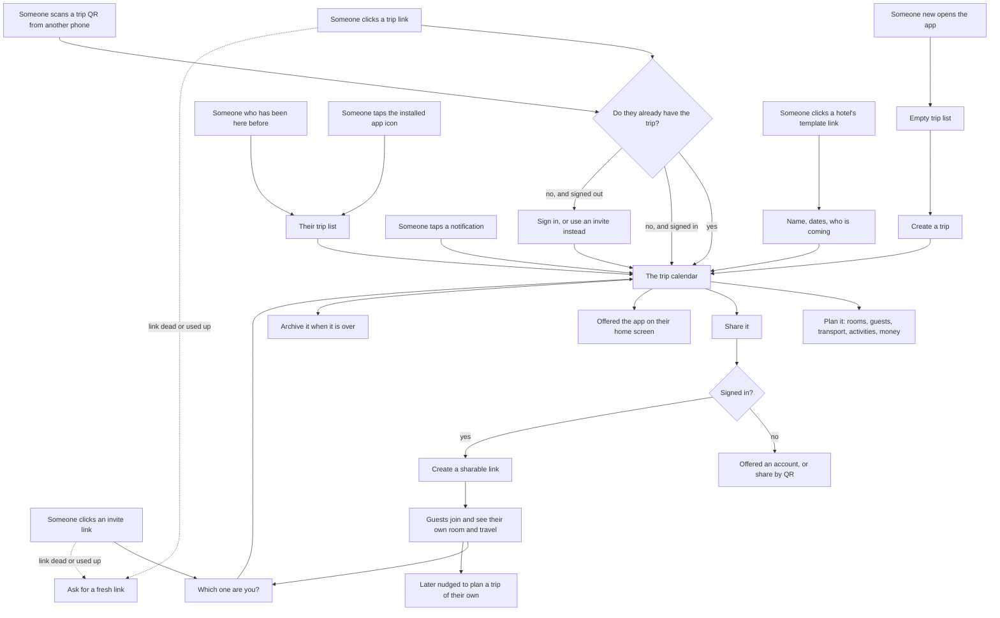

# Kikouchou

> A PWA application to help you organize your vacation house rooms and arrivals/departures.

**Live**: <https://app.kikouchou.app> — deployed to GitHub Pages by
[`.github/workflows/deploy.yml`](.github/workflows/deploy.yml) on every push to `main`.

**Pitch**: You're on vacation with friends and renting a house together. Kikouchou helps you assign rooms and never forget to pick up or drop off your friends at the train station.

## Features (MVP)

- **Calendar View** - Visualize who sleeps where and when
- **Room Management** - Manage rooms with capacity and assignments
- **Guest Groups** - Save a family or a band of friends once, add them to any trip in one go
- **Transport Tracking** - Track arrivals/departures with detailed transport info
- **Trip Sharing** - Share trips via links and QR codes
- **Offline-First** - Works without internet after first load
- **Multi-language** - French and English support

## User flows

How people get into a trip, and what they do once they are there. Everything
works without an account and offline. You sign in only to share a trip with
other people.



## Tech Stack

| Category   | Technology               |
|------------|--------------------------|
| Runtime    | Bun                      |
| Build Tool | Vite                     |
| Framework  | React 18 + TypeScript    |
| UI Library | shadcn/ui + Tailwind CSS |
| Database   | IndexedDB (Dexie.js)     |
| i18n       | react-i18next            |

## Documentation

- [IDEAS.md](./IDEAS.md) - Original project ideas and brainstorming
- [TODO.md](./TODO.md) - Comprehensive step-by-step implementation guide

## Getting Started

```bash
# Install dependencies
bun install

# Start development server
bun run dev

# Build for production
bun run build
```

## License

MIT
